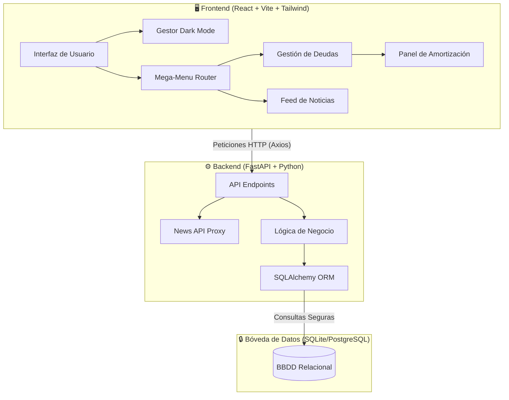
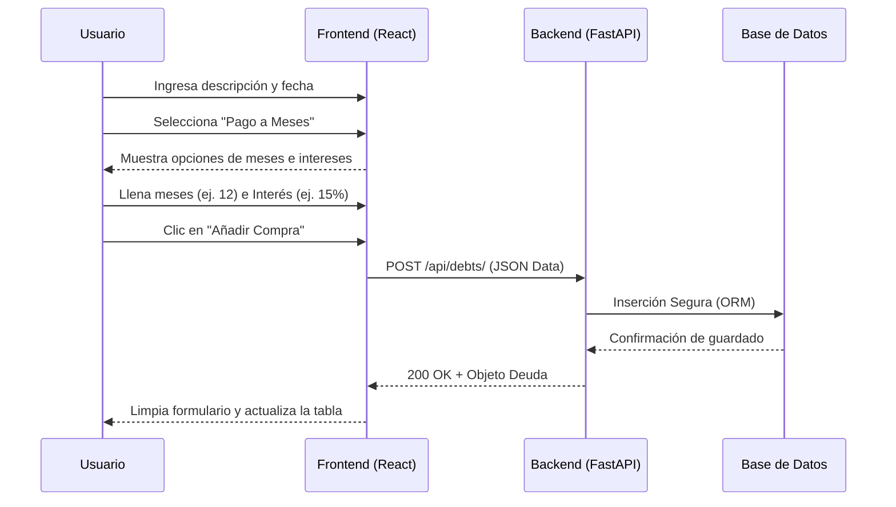

# Financiera

¡Bienvenido a Financiera! Gestionar el dinero no debería ser un dolor de cabeza ni una tarea exclusiva de expertos. Este proyecto nació con un propósito claro: crear una herramienta digital, intuitiva y realmente efectiva para ayudarte a tomar el control de tus finanzas personales.

Diseñada con estándares de la industria, interfaz premium y arquitectura escalable.

---

## 🌟 Características Principales

La mayoría de las herramientas financieras son confusas o aburridas. Financiera se enfoca en resolver problemas reales mediante una Experiencia de Usuario (UX) de primer nivel:

- **Lobby Minimalista:** Pantalla de bienvenida limpia con integración de **Dark Mode** (Modo Oscuro) persistente en el dispositivo del usuario.
- **Mega-Menú de Navegación:** Navegación interna estilo "Google Developers" con paneles desplegables amplios para agilizar la interacción.
- **Gestión Efectiva de Deudas:** Registra tus créditos, compras a meses (con o sin intereses) o de contado. Soporte para múltiples divisas (MXN/USD).
- **Panel Inteligente de Detalles (Master-Detail):** Al hacer clic en una compra, un elegante panel lateral deslizable (Slide-over) calcula en tiempo real:
  - Los meses transcurridos y el porcentaje de progreso.
  - El desglose matemático entre el capital real y los intereses generados.
  - El **calendario de amortización** (línea de tiempo de pagos).
- **Noticias Financieras en Tiempo Real:** Sección con filtro inteligente de noticias económicas relevantes, obtenidas mediante un proxy en nuestro backend.

---

## 🏗 Arquitectura y Stack Tecnológico

Para lograr que la aplicación sea rápida, segura y fácil de modificar, usamos una **arquitectura desacoplada (Frontend / Backend)**.

### Diagrama de Arquitectura de Alto Nivel



### Tecnologías Clave:
- **Frontend:** React, TypeScript, Vite, Tailwind CSS, Lucide React.
- **Backend:** Python, FastAPI, SQLAlchemy, Alembic (Migraciones).
- **Base de Datos:** SQLite (Desarrollo) / PostgreSQL (Producción).

---

## 🔄 Flujos de Usuario (User Flows)

### Flujo 1: Creación de Nueva Deuda
El usuario tiene una experiencia fluida al registrar una nueva compra, con el formulario adaptándose a sus respuestas dinámicamente.



### Flujo 2: Panel Inteligente de Amortización (Slide-over)
Una de las funcionalidades más potentes es el cálculo en vivo sin sobrecargar la base de datos.

```mermaid
flowchart LR
    A[El usuario hace clic en una fila de la tabla] --> B[React activa 'selectedDebt']
    B --> C{¿Es deuda a meses?}
    C -- Sí --> D[El Frontend lee 'purchase_date']
    D --> E[Calcula meses transcurridos al día de hoy]
    E --> F[Genera Línea de Tiempo de Pagos]
    F --> G[Dibuja Barra de Progreso y Desglose Financiero]
    C -- No --> H[Muestra resumen simplificado]
    G --> I[Se despliega el Panel Lateral (Slide-over) con animaciones CSS]
    H --> I
```

---

## 🚀 Guía de Inicio Rápido

Si eres colaborador del proyecto, sigue estos pasos en tu terminal para levantar el entorno de desarrollo en tu Mac:

### 1. Clonar el Repositorio
```bash
git clone https://github.com/HugoTrejo13/Financiera.git
cd Financiera
```

### 2. Encender el Backend (Servidor)
Abre la terminal y ejecuta:
```bash
cd backend
python3 -m venv .venv
source .venv/bin/activate
pip install -r requirements.txt
uvicorn app.main:app --reload
```
> [!NOTE]  
> Accede a la documentación automática de las rutas de tu API en: [http://localhost:8000/docs](http://localhost:8000/docs)

### 3. Encender el Frontend (Interfaz Web)
Abre una **nueva pestaña** de la Terminal y ejecuta:
```bash
cd frontend
npm install
npm run dev
```

> [!TIP]  
> Abre tu navegador en **http://localhost:5173** para empezar a interactuar con la plataforma en modo desarrollo (HMR activado).
