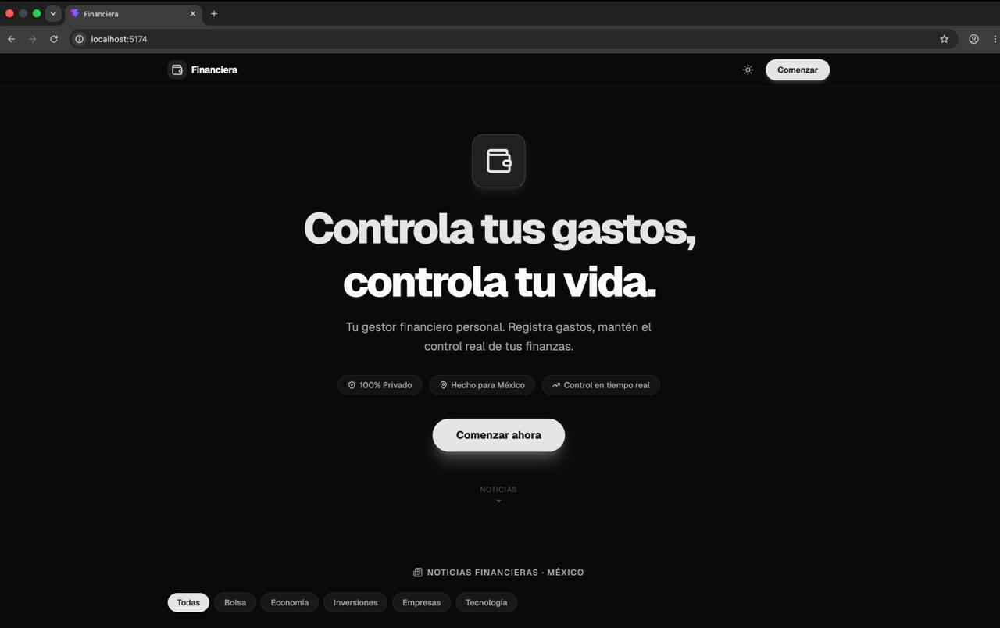

<div align="center">
  <h1>Financiera</h1>
  <p>A smart personal finance tracker with automated currency conversion and amortization schedules.</p>

  [](#)
  [](#)
  [](#)
</div>



## 📖 About
Financiera is a personal finance application built to help users take control of their expenses and debts without dealing with confusing spreadsheets. It automatically calculates interest rates, builds payment timelines for installment purchases, and fetches real-time currency exchange rates. It solves the problem of tracking complex liabilities by providing a clean, centralized, and visual dashboard.

## ✨ Features
- **Track** cash purchases and installment debts (with or without interest).
- **Categorize** expenses with visual icons and colors for better organization.
- **Visualize** spending patterns with interactive pie charts grouped by category.
- **Calculate** automatic amortization schedules and timeline progress for active debts.
- **Convert** USD to MXN dynamically using the real-time Frankfurter API.
- **Edit** existing financial records seamlessly through a robust centered modal interface.
- **Filter** expenses by date range to analyze specific periods.
- **Read** filtered real-time economic and financial news directly from the dashboard.

## 🛠 Tech Stack

**Frontend**  


**Backend**  


## 🚀 Getting Started

### Prerequisites
- Node.js (v18+)
- Python (3.9+)

### Installation

```bash
# Clone the repository
git clone https://github.com/HugoTrejo13/Financiera.git
cd Financiera

# Setup Backend
cd backend
python -m venv venv
source venv/bin/activate  # On Windows: venv\Scripts\activate
pip install -r requirements.txt

# Initialize default categories (run once)
python init_categories.py

# Start backend server
uvicorn app.main:app --reload

# Setup Frontend (in a new terminal)
cd frontend
npm install
npm run dev
```

### Usage
```bash
# Open your browser and navigate to http://localhost:5173
# 1. Add a new expense by clicking "Nueva compra"
# 2. Select a category (Food, Transport, etc.)
# 3. Choose payment type (cash or installments)
# 4. For USD purchases, watch the exchange rate auto-fill
# 5. View your expense breakdown by category in the interactive chart
```

## 📬 Contact
**Hugo Trejo**  
[](https://github.com/HugoTrejo13)
